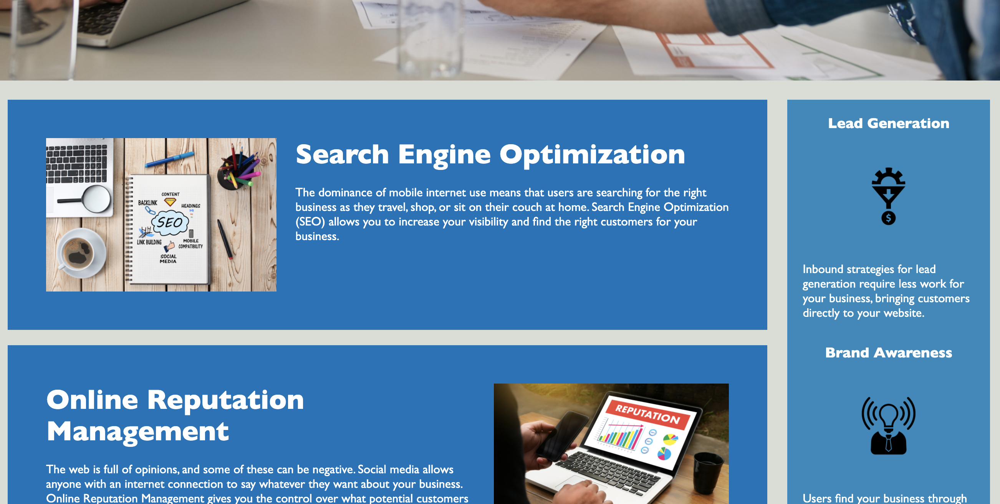

# Advanced Refactoring

## Description

In this project I worked on refactoring the html and css for the Heriseon website. 

Firstly, I added all of the accessabitlity features needs for the website to be accessible via screen readers and other viewing alternatives. I made the title search friendly, I provided text alternatives for all of the images, I used the proper elements for each component of the html, and I unsured those elements were labeled chronologically. I also added notes within the html so others may follow along more appropriately with the layout of the html.

Secondly, I refactored the css. I initially, added comments to help understand the layout of the CSS. Then, I consolidated similar components to minimized the lines of code needed to achieve the layout and features. 


## Usage

Here is a link to the deployed webpage for your convenience: 

https://fausnightm.github.io/Advanced-Refactoring/

These are screenshots of what the live webpage looks like:

``` md

```
``` md

```
``` md

```

